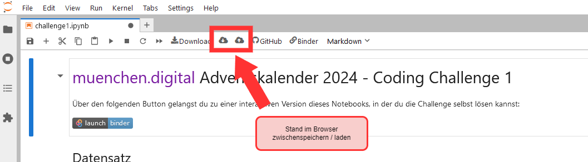

<!-- add Project Logo, if existing -->

# [München.Digital.](https://muenchen.digital) Advent Coding Challenges 2024

[![Made with love by it@M][made-with-love-shield]][itm-opensource]
[![München.Digital. Adventskalender][adventskalender-shield]][muenchen-digital]
[![GitHub Repository][github-shield]][github-url]
[![Binder starten][binder-shield]][start-binder]
<!-- feel free to add more shields, style 'for-the-badge' -> see https://shields.io/badges -->

Hier findet ihr die Coding Challenges zum Adventskalender 2024 von [München.Digital.](https://muenchen.digital)

## Challenges

Über den kostenlosen Service `Binder` könnt ihr die Challenges bearbeiten: 

- ⛄ Challenge 1: [In Binder öffnen und bearbeiten][challenge1-binder] / [Code-Vorlage anzeigen][challenge1-github] 
- 🎄 Challenge 2: [In Binder öffnen und bearbeiten][challenge2-binder] / [Code-Vorlage anzeigen][challenge2-github] (bis 15.12.2024 am Gewinnspiel (s.u.) teilnehmen)
- 🎅 Challenge 3 (ab 16.12.2024) 
- 🎁 Challenge 4 (ab 23.12.2024) 

⚠ **Achtung:** ⚠

Binder beendet eure Sitzung nach 20 Minuten Inaktivität.
Speichert eure Arbeit ab, um Datenverlust zu vermeiden.
Dazu einfach die Buttons oben im Notebook verwenden.

## Gewinnspiel

ℹ️ So funktioniert das Gewinnspiel rund um die KICC Coding Challenge:

- ✔️ folgt uns auf dem jeweiligen Social Media Kanal eurer Wahl ([LinkedIn][linkedin-link] oder [Instagram][instagram-link])
- ✔️ teilt euer Ergebnis in einem eigenen Beitrag oder schickt uns eine Direktnachricht mit eurer Lösung
- ✔️ wer den Beitrag teilt bekommt extra gutes Karma (ist aber kein Muss)

Viel Erfolg beim Mitmachen und eine frohe Adventszeit!🍀🙌

Schaut gerne auch auf [Instagram][instagram-link] bei unserem täglichen Adventskalender vorbei und erfahrt unter anderem spannende technische Tipps und Tricks passend zur Weihnachtszeit, interessante Fun Facts mit IT-Bezug sowie Empfehlungen für To Dos in der Vorweihnachtszeit.✨❄️

### Teilnahmebedingungen

Teilnahmezeitraum für das Gewinnspiel der zweiten Coding Challenge ist vom 8. Dezember bis zum 15. Dezember um 23.59 Uhr. 
Die Gewinnerin oder der Gewinner wird am 16. Dezember per Zufallsgenerator aus allen richtigen Einsendungen ausgelost und per Direktnachricht von uns informiert. 
Die Teilnahme ist freiwillig. Teilnahmeberechtigt sind natürliche Personen, die zum Zeitpunkt der Teilnahme mindestens 18 Jahre alt sind und einen Wohnsitz in Deutschland haben.
Veranstalter des Gewinnspiels ist das IT-Referat der Landeshauptstadt München, Büro der Referentin, Agnes-Pockels-Bogen 33, 80992 München. 
Das Gewinnspiel steht in keiner Verbindung zu LinkedIn oder zur Meta Plattform (Instagram oder Facebook) und wird in keiner Weise von einem dieser Unternehmen gesponsert, unterstützt oder organisiert. 

### Datenschutzbestimmungen 

Mit der Teilnahme willigen die Teilnehmenden ein, dass die übermittelten Daten zum Zwecke des Gewinnspiels verarbeitet werden. Die Kontaktdaten werden ausschließlich für das Gewinnspiel zur Verteilung der Gewinne verwendet. Nach Beendigung des Gewinnspiels werden die Daten gelöscht. Persönliche Daten werden nicht zu kommerziellen Zwecken gespeichert oder weitergegeben.

## Hilfe bei Problemen

Zu jeder Challenge gibt es auch eine Musterlösung nach Ende des jeweiligen Gewinnspielzeitraums (siehe oben).
Folgende Lösungen stehen schon zur Verfügung:

- 🎁 Challenge 1: [Musterlösung anzeigen][]

Falls ihr Fragen oder Probleme habt, könnt ihr gerne ein [Issue erstellen](https://github.com/it-at-m/advent-coding-challenges-24/issues/new) oder uns [eine E-Mail schreiben](mailto:itm.kicc@muenchen.de).

## License

Distributed under the MIT License. See [LICENSE](LICENSE) file for more information.

## Contact

it@M KICC - itm.kicc@muenchen.de

[![LinkedIn][linkedin-shield]][linkedin-link]
[![Instagram][instagram-shield]][instagram-link]

<!-- project shields / links -->
[made-with-love-shield]: https://img.shields.io/badge/made%20with%20%E2%9D%A4%20by-it%40M-yellow?style=flat
[adventskalender-shield]: https://img.shields.io/badge/M%C3%BCnchen.Digital.-%F0%9F%8E%84%20Adventskalender-1e6cff?style=flat
[binder-shield]: https://mybinder.org/badge_logo.svg
[github-shield]: https://img.shields.io/badge/GitHub--Repository-%23121011.svg?logo=github&logoColor=white
[instagram-shield]: https://img.shields.io/badge/Instagram-%23E4405F.svg?logo=Instagram&logoColor=white
[linkedin-shield]: https://img.shields.io/badge/Linkedin-%230077B5.svg?logo=linkedin&logoColor=white

[itm-opensource]: https://opensource.muenchen.de/
[muenchen-digital]: https://muenchen.digital/
[github-url]: https://github.com/it-at-m/advent-coding-challenges-24

[start-binder]: https://mybinder.org/v2/gh/it-at-m/advent-coding-challenges-24/HEAD
[challenge1-binder]: https://mybinder.org/v2/gh/it-at-m/advent-coding-challenges-24/HEAD?urlpath=lab%2Ftree%2Fchallenges%2Fchallenge1.ipynb
[challenge2-binder]: https://mybinder.org/v2/gh/it-at-m/advent-coding-challenges-24/HEAD?urlpath=lab%2Ftree%2Fchallenges%2Fchallenge2.ipynb

[challenge1-github]: https://github.com/it-at-m/advent-coding-challenges-24/blob/main/challenges/challenge1.ipynb
[solution1-github]: https://github.com/it-at-m/advent-coding-challenges-24/blob/main/solutions/challenge1_solution.ipynb
[challenge2-github]: https://github.com/it-at-m/advent-coding-challenges-24/blob/main/challenges/challenge2.ipynb

[linkedin-link]: https://www.linkedin.com/showcase/muenchen-digital/
[instagram-link]: https://www.instagram.com/muenchen.digital/